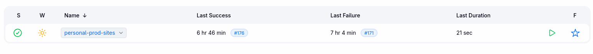
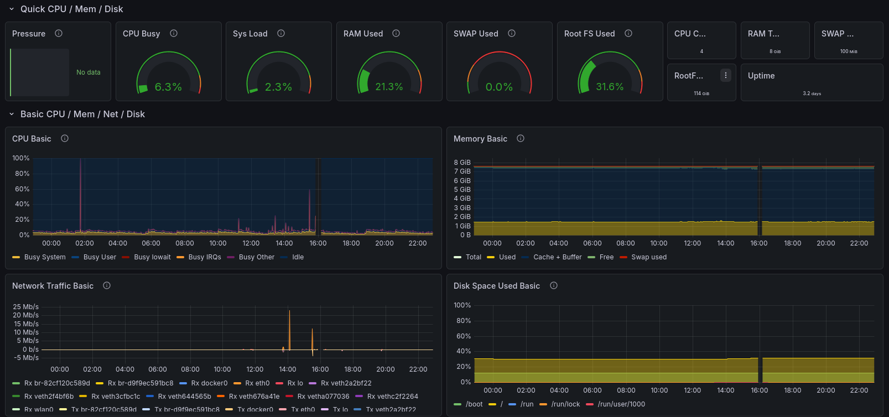

# DevOps Home-Lab: Raspberry Pi CI/CD & Monitoring Stack

A self-hosted DevOps ecosystem deployed on a Raspberry Pi, featuring a fully automated Jenkins pipeline, Nginx reverse proxying, and a Prometheus/Grafana monitoring.

## System Architecture

The project is hosted on a local Raspberry Pi made accessible via Port Forwarding on a public IP.

CI/CD Pipeline (Jenkins)
- Custom Branching: Supports dynamic builds based on git branches.
- Security: Trivy integration for filesystem and image scanning.

Monitoring (Prometheus & Grafana)
- Real-time system and container metrics.
- Visualization via pre-made, optimized dashboards.

## Challanges

### 1. The 64-bit Architecture Hurdle
Issue: By default, the Raspberry Pi OS environment was running a 32-bit Docker engine, causing compatibility issues with modern DevOps tool images (like newer Jenkins/Grafana builds).\
Solution: Conducted a deep-dive audit of the system architecture, application requirements, and kernel support. I successfully migrated the environment to 64-bit Docker, ensuring long-term stability and image compatibility.

### 2. Jenkins "Docker-out-of-Docker" (DooD) Pathing
Issue: Encountered volume mapping failures when using DooD. The Jenkins container couldn't resolve paths correctly when communicating with the host’s Docker socket.\
Solution: To ensure persistence and proper execution, I standardized the volume mounting to the local host path `/var/jenkins_home`, aligning the container’s internal state with the physical storage of the Pi.

## Tech Stack

Infrastructure: Raspberry Pi, Docker, Docker Compose\
Proxy: Nginx\
CI/CD: Jenkins, Groovy (Pipelines)\
Security: Trivy\
Monitoring: Prometheus, Grafana
